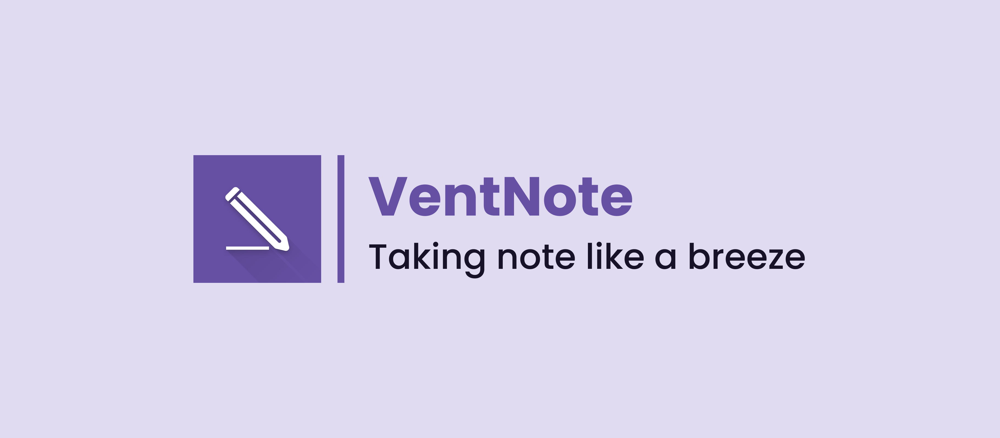
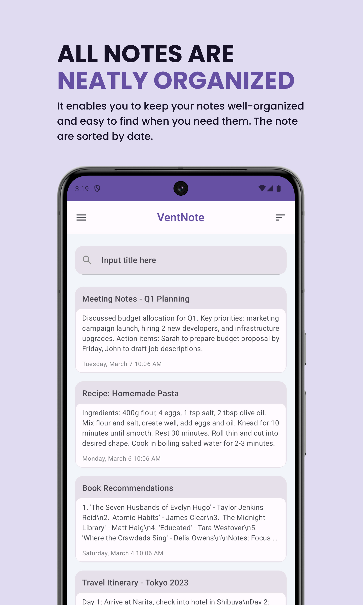
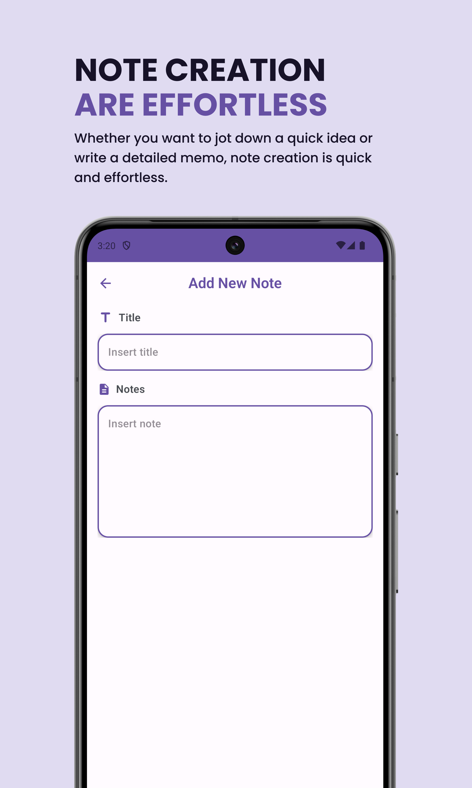
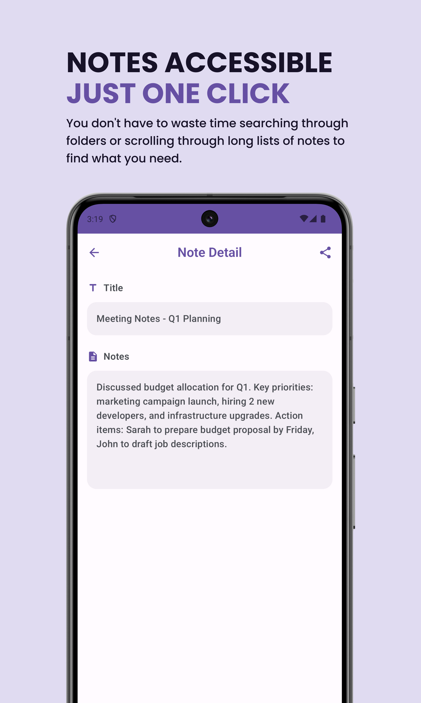
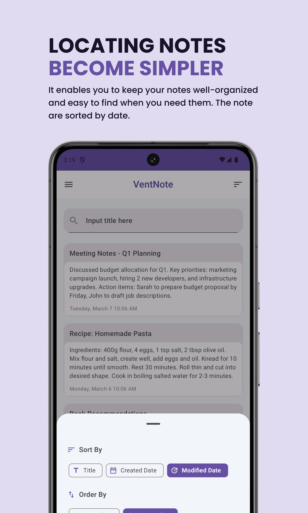
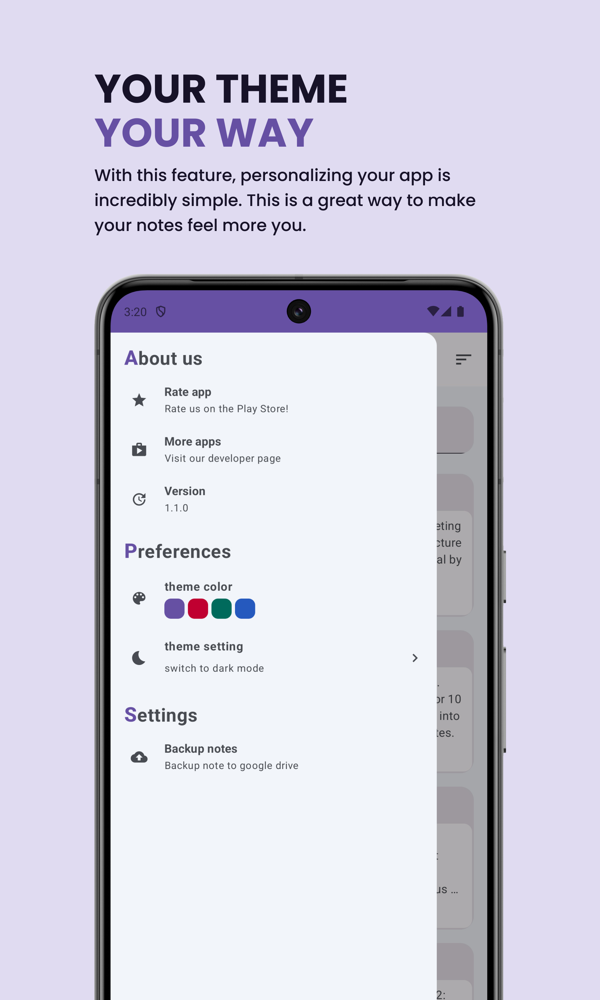
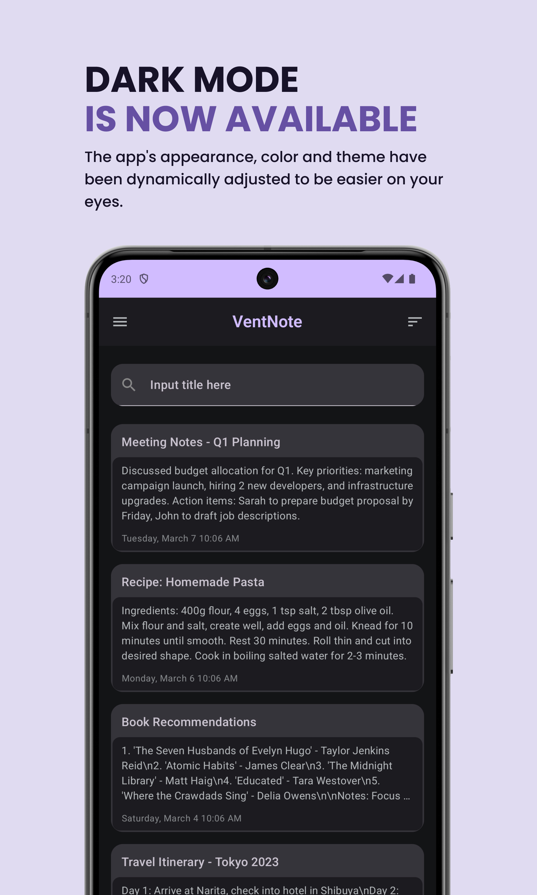
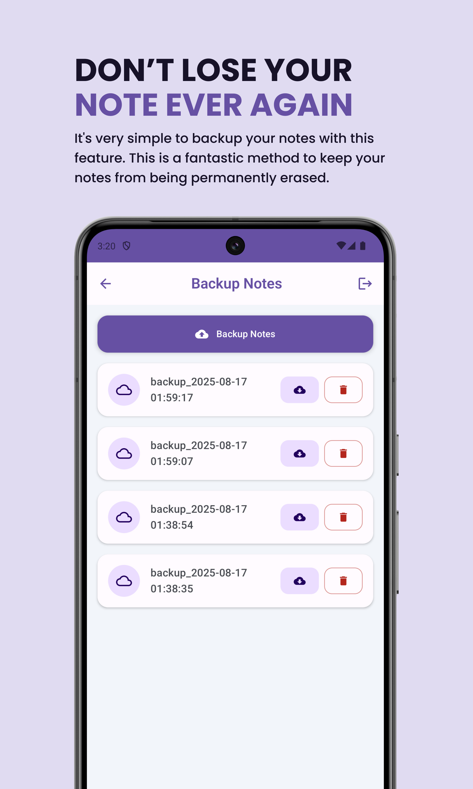

<div align="center">
  

  <br /><br />

  [](./LICENSE)
  [](https://github.com/HellBus1/VentNote/releases)
  [](https://github.com/HellBus1/VentNote)
  [](https://developer.android.com/jetpack/compose)

  <h3>Taking notes like a breeze.</h3>
  <p>An intuitive, modern note management Android application built with <b>Jetpack Compose</b>, <b>Clean Architecture</b>, <b>Kotlin Coroutines & Flow</b>, <b>Room SQLite</b>, and <b>Material 3 Design</b>.</p>
</div>

<br />

---

## 📸 Feature Showcase

VentNote delivers an aesthetically pleasing, friction-free note-taking experience with adaptive layouts, vibrant theming, and robust categorization:

<div align="center">
  <table>
    <tr>
      <td align="center" width="33%">
        <br />
        <b>Dashboard & Tag Chips</b><br />
        <sub>Adaptive Staggered Grid, Category Filter Chips, and Quick Pin Button</sub>
      </td>
      <td align="center" width="33%">
        <br />
        <b>Note Editor & Markdown</b><br />
        <sub>Rich text formatting toolbar, empty title flexibility ("Untitled"), and tag selection</sub>
      </td>
      <td align="center" width="33%">
        <br />
        <b>Note Detail & Reading</b><br />
        <sub>Rendered Markdown formatting, category badges, and inline editing</sub>
      </td>
    </tr>
    <tr>
      <td align="center" width="33%">
        <br />
        <b>Navigation & Theming</b><br />
        <sub>Dark/Light mode switch, 4 curated Material 3 color palettes, and tool shortcuts</sub>
      </td>
      <td align="center" width="33%">
        <br />
        <b>Tag & Category Manager</b><br />
        <sub>12-color curated palette, duplicate prevention, and cascading deletion</sub>
      </td>
      <td align="center" width="33%">
        <br />
        <b>Google Drive Sync</b><br />
        <sub>Hidden <code>appDataFolder</code> storage, dual-format restore, and timestamp retention</sub>
      </td>
    </tr>
    <tr>
      <td align="center" colspan="3">
        <br />
        <b>Export, Sharing & Batch Actions</b><br />
        <sub>Export notes as text/image preview, multi-select marking mode, and batch deletion</sub>
      </td>
    </tr>
  </table>
</div>

<br />

---

## 📱 Features

- [x] **Minimal & Aesthetic UI:** Built entirely with Jetpack Compose Material 3; adapts seamlessly across compact phones, foldables, and tablets.
- [x] **Note Pinning:** Pin important notes to permanently affix them at the top of your list with priority SQL sorting (`is_pinned DESC`).
- [x] **Tags & Category System:** Organize notes using custom colored tags, a 12-color curated palette, and a dashboard horizontal filter chip bar. Notes support up to 3 tags max.
- [x] **Rich Text & Markdown Editor:** Format notes on the fly with bold, italic, strikethrough, underline, and bulleted/ordered lists.
- [x] **Flexible Note Creation:** Write notes without requiring a title; automatically displays a graceful, localized `"Untitled"` fallback.
- [x] **Dual View Modes:** Seamlessly switch between a clean **Linear List** and a dynamic **Staggered Grid**, persisted via AndroidX DataStore.
- [x] **Live Search & Dynamic Multi-Sorting:** Instant search across titles and body text; sort notes by Updated Date, Created Date, or Title in Ascending/Descending order.
- [x] **Multi-Select & Batch Deletion (Marking Mode):** Long-press to enter selection mode, select/unselect all, and safely delete multiple notes with modal confirmation.
- [x] **Google Drive Cloud Backup & Restore:** Securely backup your entire workspace (notes, tags, and cross-references) to your hidden Google Drive `appDataFolder`. Restores preserve **original historical timestamps** and support backward compatibility with legacy Version 0 backups.
- [x] **Personalization & Dark Mode:** Choose between Dark Mode and Light Mode, and personalize your experience with 4 bespoke Material 3 color palettes (Purple, Crimson, Cadmium Green, Cobalt Blue).
- [x] **Launcher App Widget:** Stay productive with an interactive Android home screen widget showing your latest notes with instant deep-linking.
- [x] **Share Preview:** Export and share notes with friends and colleagues as formatted text or styled images.
- [x] **In-App Updates:** Integrated Google Play Core update checks.

<br />

---

## 📚 Technical Documentation & QA Matrix

Comprehensive architecture guides, feature specifications, and manual test matrices are available in the **[`/docs`](docs/README.md)** directory:

* **[Architecture: System Overview](docs/architecture/system_overview.md):** Clean Architecture, MVVM + MVI Unidirectional Data Flow, reactive pipelines, and Hilt dependency injection.
* **[Architecture: Database & Persistence](docs/architecture/database_and_persistence.md):** Room SQLite schemas (`NoteModel`, `TagModel`, `NoteTagCrossRef`), Many-to-Many relations, foreign key cascades, and indexing strategies.
* **[Manual QA Testing Matrix](docs/manual_testing/qa_flow_matrix.md):** Production-grade test matrix featuring 47 test cases spanning 10 modules with step-by-step procedures, expected outcomes, and edge-case verifications.
* **Feature Deep-Dives:**
  * [Note Management](docs/features/note_management.md)
  * [Note Editor & Markdown](docs/features/note_editor.md)
  * [Note Pinning](docs/features/note_pinning.md)
  * [Tag & Category System](docs/features/tag_category_system.md)
  * [Google Drive Backup & Restore](docs/features/google_drive_backup_restore.md)
  * [App Customization & Theming](docs/features/app_customization_and_theming.md)
  * [Launcher App Widget](docs/features/app_widget.md)
* **[Technical Reference & Schemas](docs/reference/data_contracts_and_schemas.md):** JSON backup contracts, Room DAO interfaces, and UI test tags.

<br />

---

## 🛠 Technology Stack

| Layer | Technologies |
| :--- | :--- |
| **Language & Concurrency** | [Kotlin](https://kotlinlang.org/) (1.8+), [Coroutines](https://kotlinlang.org/docs/coroutines-overview.html), [StateFlow / Flow](https://kotlinlang.org/docs/flow.html) |
| **UI Framework** | [Jetpack Compose](https://developer.android.com/jetpack/compose) with [Material 3](https://m3.material.io/) |
| **Architecture** | Modern Android Architecture (Clean Architecture + MVVM + UDF) |
| **Dependency Injection** | [Dagger Hilt](https://dagger.dev/hilt/) |
| **Local Database** | [AndroidX Room](https://developer.android.com/training/data-storage/room) (SQLite ORM) |
| **Key-Value Storage** | [AndroidX DataStore Preferences](https://developer.android.com/topic/libraries/architecture/datastore) |
| **Cloud Storage** | [Google Drive REST API v3](https://developers.google.com/drive) (via Google Play Services Auth) |
| **Markdown Engine** | Custom Rich Text & Markdown Parser |
| **Testing** | AndroidX Compose Test, Espresso, JUnit 4, Hilt Android Testing |

<br />

---

## 📥 Installation & Getting Started

### Prerequisites
- Android Studio Hedgehog or newer
- Android SDK 34
- JDK 17 (recommended: Android Studio bundled JBR)
- Physical device or Emulator running Android 5.1 (API 22) or higher

### Building from Source
```bash
# 1. Clone the repository
git clone https://github.com/HellBus1/VentNote.git
cd VentNote

# 2. Checkout the latest branch
git checkout staging

# 3. Build debug APK
./gradlew assembleDebug

# 4. Install onto connected Android device
adb install -r app/build/outputs/apk/debug/app-debug.apk
```

### Running Tests
```bash
# Run unit tests
./gradlew testDebugUnitTest

# Run instrumented integration tests (requires connected emulator/device)
./gradlew connectedDebugAndroidTest
```

<br />

---

## 🤝 Contribution Guide

Contributions are welcome! Please follow these steps:
1. Fork the repository and clone your fork locally.
2. Create a feature branch from `staging` (e.g., `git checkout -b feature/awesome-feature`).
3. Make your improvements, ensuring code conforms to project architecture and existing tests pass.
4. Push to your fork and submit a Pull Request targeting the `staging` branch.

<br />

---

## ☕ Support the Project

If you find VentNote helpful or use it as reference for modern Android development with Jetpack Compose, please consider leaving a star ⭐️ or supporting development:

<div align="center">
  <a href="https://www.buymeacoffee.com/syubban">
    
  </a>
</div>

<br />

---

## 📄 License

This project is licensed under the Apache License 2.0 - see the [LICENSE](./LICENSE) file for details.
