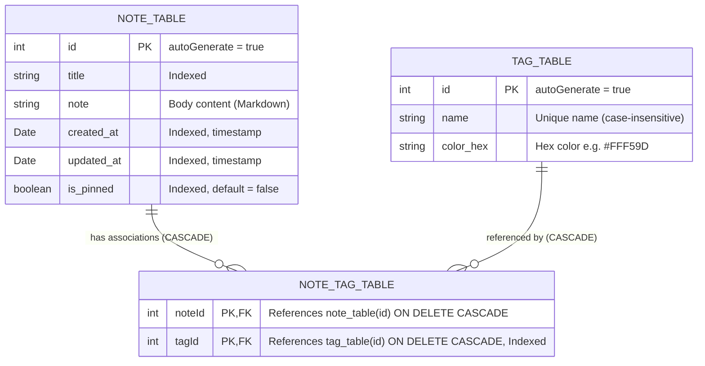

# Architecture: Database & Persistence Layer

This document details the local persistence architecture of VentNote, including the SQLite database schema implemented via **AndroidX Room**, Many-to-Many relational modeling, indexing strategy, foreign key cascades, and key-value preference storage via **AndroidX DataStore**.

---

## 1. Entity Relationship Diagram (ERD)

VentNote models a Many-to-Many ($M:N$) relationship between notes and tags. A note can be categorized with up to 3 tags, and a tag can be associated with multiple notes.



---

## 2. Table Schemas & Room Entities

### 2.1 Note Entity (`note_table`)
Defined in [`NoteModel.kt`](file:///Users/syubbanfakhriya/Desktop/Repository/side-project/VentNote/app/src/main/java/com/digiventure/ventnote/data/persistence/entity/NoteModel.kt).

```kotlin
@Entity(
    tableName = "note_table",
    indices = [
        Index(value = ["title"]),
        Index(value = ["created_at"]),
        Index(value = ["updated_at"]),
        Index(value = ["is_pinned"])
    ]
)
data class NoteModel(
    @PrimaryKey(autoGenerate = true) val id: Int,
    @ColumnInfo(name = "title") val title: String,
    @ColumnInfo(name = "note") val note: String,
    @ColumnInfo(name = "created_at") var createdAt: Date = Date(System.currentTimeMillis()),
    @ColumnInfo(name = "updated_at") var updatedAt: Date = Date(System.currentTimeMillis()),
    @ColumnInfo(name = "is_pinned") val isPinned: Boolean = false,
): Parcelable
```

#### Indexing Strategy:
* `title`: Accelerates text prefix and equality lookups.
* `created_at` & `updated_at`: Enables lightning-fast sorting in both `ASC` and `DESC` directions without requiring temporary table sorting in SQLite.
* `is_pinned`: Indexed because every query sorts on `is_pinned DESC` as the primary sort column.

---

### 2.2 Tag Entity (`tag_table`)
Defined in [`TagModel.kt`](file:///Users/syubbanfakhriya/Desktop/Repository/side-project/VentNote/app/src/main/java/com/digiventure/ventnote/data/persistence/entity/TagModel.kt).

```kotlin
@Entity(tableName = "tag_table")
data class TagModel(
    @PrimaryKey(autoGenerate = true) val id: Int = 0,
    @ColumnInfo(name = "name") val name: String,
    @ColumnInfo(name = "color_hex") val colorHex: String
) : Parcelable
```

* `id`: Auto-generated unique integer identifier.
* `name`: The user-defined category name (e.g., `"Work"`, `"Ideas"`). Validated in the application layer for case-insensitive uniqueness.
* `color_hex`: Hexadecimal color string (e.g., `"#EF9A9A"`) corresponding to one of the 12 curated Material palette selections.

---

### 2.3 Cross-Reference Entity (`note_tag_table`)
Defined in [`NoteTagCrossRef.kt`](file:///Users/syubbanfakhriya/Desktop/Repository/side-project/VentNote/app/src/main/java/com/digiventure/ventnote/data/persistence/entity/NoteTagCrossRef.kt).

```kotlin
@Entity(
    tableName = "note_tag_table",
    primaryKeys = ["noteId", "tagId"],
    foreignKeys = [
        ForeignKey(
            entity = NoteModel::class,
            parentColumns = ["id"],
            childColumns = ["noteId"],
            onDelete = ForeignKey.CASCADE
        ),
        ForeignKey(
            entity = TagModel::class,
            parentColumns = ["id"],
            childColumns = ["tagId"],
            onDelete = ForeignKey.CASCADE
        )
    ],
    indices = [Index(value = ["tagId"])]
)
data class NoteTagCrossRef(
    val noteId: Int,
    val tagId: Int
)
```

#### Relational Constraints & Cascading:
1. **Composite Primary Key:** `[noteId, tagId]` prevents duplicate cross-references between the same note and tag.
2. **Cascading Note Deletion:** If a note is deleted from `note_table`, SQLite automatically removes all matching entries from `note_tag_table`. The tags themselves in `tag_table` remain completely untouched.
3. **Cascading Tag Deletion:** If a tag is deleted from `tag_table`, all junction links in `note_tag_table` are automatically deleted. The notes themselves remain safe in `note_table` and gracefully transition to uncategorized status.
4. **Index on `tagId`:** Room automatically indexes the first primary key column (`noteId`), but requires an explicit index on `tagId` to optimize queries filtering notes by a specific tag.

---

## 3. Relational Projection (`NoteWithTags`)

To retrieve notes along with their associated tags in a single transactional query, VentNote utilizes Room's relational mapping:

```kotlin
data class NoteWithTags(
    @Embedded val note: NoteModel,
    @Relation(
        parentColumn = "id",
        entityColumn = "id",
        associateBy = Junction(
            value = NoteTagCrossRef::class,
            parentColumn = "noteId",
            entityColumn = "tagId"
        )
    )
    val tags: List<TagModel>
)
```

In addition to transactional relation queries, the app features a high-performance reactive combine flow in `NotesPageVM`:
```kotlin
combine(
    tagRepository.getAllTags(),
    databaseProxy.tagDao().getAllNoteTagCrossRefsFlow()
) { tagsResult, crossRefs ->
    val tags = tagsResult.getOrDefault(emptyList())
    crossRefs.groupBy { it.noteId }
        .mapValues { entry ->
            entry.value.mapNotNull { ref -> tags.find { it.id == ref.tagId } }
        }
}
```
This produces a reactive `Map<Int, List<TagModel>>` stream that immediately refreshes note cards whenever a tag is renamed, recolored, added, or deleted.

---

## 4. Key DAO Operations & Query Logic

### 4.1 Prioritized Multi-Sorting Query (`NoteDAO.kt`)
The primary query in `NoteDAO` dynamically sorts notes by Title, Created Date, or Updated Date in Ascending or Descending order, while **always prioritizing pinned notes at the top**:

```sql
SELECT * FROM note_table ORDER BY 
    is_pinned DESC, 
    CASE WHEN :sortBy = 'title' AND :orderBy = 'ASC' THEN title END ASC, 
    CASE WHEN :sortBy = 'title' AND :orderBy = 'DESC' THEN title END DESC, 
    CASE WHEN :sortBy = 'created_at' AND :orderBy = 'ASC' THEN created_at END ASC, 
    CASE WHEN :sortBy = 'created_at' AND :orderBy = 'DESC' THEN created_at END DESC, 
    CASE WHEN :sortBy = 'updated_at' AND :orderBy = 'ASC' THEN updated_at END ASC, 
    CASE WHEN :sortBy = 'updated_at' AND :orderBy = 'DESC' THEN updated_at END DESC
```

### 4.2 Filter by Tag Query (`NoteDAO.kt`)
When a user selects a tag chip in the folder bar, `NoteDAO.getNotesByTag()` joins `note_table` with `note_tag_table`:

```sql
SELECT note_table.* FROM note_table 
INNER JOIN note_tag_table ON note_table.id = note_tag_table.noteId 
WHERE note_tag_table.tagId = :tagId 
ORDER BY 
    is_pinned DESC, 
    CASE WHEN :sortBy = 'title' AND :orderBy = 'ASC' THEN title END ASC, 
    ...
```

### 4.3 Replace All Tags Transaction (`TagDAO.kt`)
When a user updates tags in the Note Editor, an atomic transaction wipes existing associations and writes new ones:

```kotlin
@Transaction
suspend fun setTagsForNote(noteId: Int, tagIds: List<Int>) {
    deleteAllTagsForNote(noteId)
    val refs = tagIds.map { NoteTagCrossRef(noteId = noteId, tagId = it) }
    insertNoteTagCrossRefs(refs)
}
```

---

## 5. Key-Value Storage (AndroidX DataStore)

For user preferences that outlive process death, VentNote uses `NoteDataStore.kt` backed by `preferencesDataStore(name = Constants.GLOBAL_PREFERENCE)`:

| Preference Key | Type | Possible Values | Default | Purpose |
| :--- | :--- | :--- | :--- | :--- |
| `NOTE_VIEW_MODE` | String | `"LIST"`, `"STAGGERED"` | `"LIST"` | Toggles home screen between Linear List and Staggered Grid |
| `COLOR_SCHEME` | String | `"LIGHT_MODE"`, `"DARK_MODE"` | System Default | UI light/dark theme preference |
| `COLOR_PALLET` | String | `"PURPLE"`, `"CRIMSON"`, `"CADMIUM_GREEN"`, `"COBALT_BLUE"` | `"PURPLE"` | Material 3 primary theme color palette |
