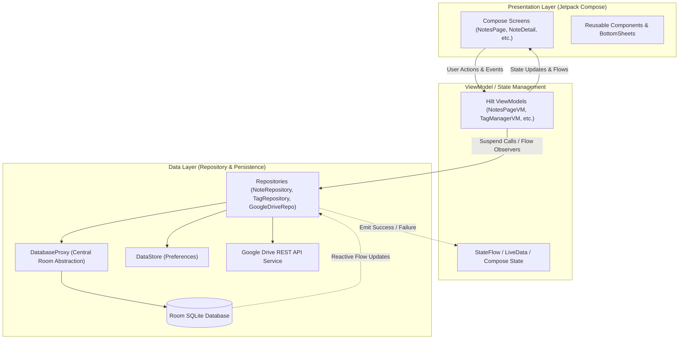
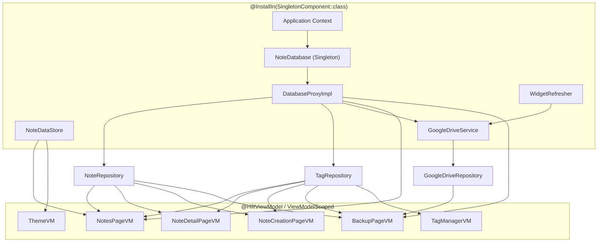

# Architecture: System Overview

This document provides a comprehensive architectural deep-dive into **VentNote**. It explains the system decomposition, reactive state management pipeline, unidirectional data flow (UDF), and dependency injection structure.

---

## 1. High-Level Architectural Pattern

VentNote follows Google's recommended **Modern Android Architecture** guidelines combined with principles from **Clean Architecture**:

* **Separation of Concerns:** Distinct boundaries between the UI (Presentation), Business Logic (ViewModel / Domain), and Data (Persistence & Network).
* **Unidirectional Data Flow (UDF):** State flows down from ViewModels to Composable functions via observable streams (`StateFlow`, `LiveData`, `Compose State`), while user events flow up as method invocations.
* **Reactive Single Source of Truth (SSOT):** The Room database serves as the absolute source of truth for notes and tags. Any write operation immediately reflects across all active observers via Kotlin `Flow`.



---

## 2. System Component Breakdown

### 2.1 Presentation Layer (Jetpack Compose)
VentNote uses 100% declarative UI built with Jetpack Compose Material 3:
* **Single Activity:** `MainActivity.kt` acts as the entry point and hosts the `NavHost`.
* **Navigation Compose:** `PageNavigation.kt` handles route definitions and screen transitions with safe argument passing (e.g., Note IDs).
* **Adaptive Screen Design:** Screen layouts adapt gracefully between compact mobile devices and wider tablet/desktop form factors, employing constraints such as `widthIn(max = 320.dp)` for drawers and responsive grid columns.

### 2.2 ViewModel Layer
ViewModels expose immutable UI state and handle coroutine lifecycle scoping via `viewModelScope`:
* **Base / Mock Interfaces:** Each ViewModel defines a Base interface (e.g., `NotesPageBaseVM`, `NoteDetailPageBaseVM`) paired with a concrete implementation (e.g., `NotesPageVM`) and a Preview mock (e.g., `NotesPageMockVM`). This decouples Compose previews from database dependencies.
* **Coroutines Dispatching:** Database and network I/O operations are explicitly dispatched onto `Dispatchers.IO` using `withContext(Dispatchers.IO)`.

### 2.3 Data & Persistence Layer
* **Room Database:** SQLite abstraction supporting reactive queries, composite indices, foreign keys, and Many-to-Many associations.
* **DatabaseProxy:** An injectable abstraction (`DatabaseProxy.kt`) providing access to `NoteDAO` and `TagDAO`, allowing test mocks without instantiating Room directly.
* **AndroidX DataStore:** Stores persistent user preferences (e.g., list vs. staggered grid view mode, active color palette, dark mode).
* **Google Drive Service:** Handles cloud backup serialization, authentication tokens, and direct REST API interaction within the hidden `appDataFolder`.

---

## 3. Reactive Data Flow Pipeline: Notes Observation

One of the central data pipelines in VentNote is the dynamic note observation engine on the home screen (`NotesPageVM.observeNotes()`).

The notes query must dynamically react to three independent user inputs:
1. **Sort Order Criteria:** (`title`, `created_at`, or `updated_at` in `ASC` or `DESC`).
2. **Tag Filter Selection:** (Either `null` for All Notes, or a specific `tagId`).
3. **Search Query Text:** Live filtering of note title/body strings.

```mermaid
sequenceDiagram
    autonumber
    actor User
    participant NotesPage as NotesPage (Compose)
    participant NotesPageVM as NotesPageVM
    participant NoteRepository as NoteRepository
    participant NoteDAO as NoteDAO (Room SQLite)

    User->>NotesPage: Taps Tag Chip (e.g., "Work")
    NotesPage->>NotesPageVM: selectedTagId.value = 2
    activate NotesPageVM
    Note NotesPageVM: combine(sortAndOrderData, snapshotFlow { selectedTagId })
    NotesPageVM->>NoteRepository: getNotesByTag(tagId=2, sortBy="updated_at", orderBy="DESC")
    activate NoteRepository
    NoteRepository->>NoteDAO: SELECT * FROM note_table INNER JOIN note_tag_table...
    activate NoteDAO
    NoteDAO-->>NoteRepository: Flow<List<NoteModel>> (Filtered Stream)
    deactivate NoteDAO
    NoteRepository-->>NotesPageVM: Flow<Result<List<NoteModel>>>
    deactivate NoteRepository
    NotesPageVM-->>NotesPage: _noteList.postValue(result)
    deactivate NotesPageVM
    NotesPage->>User: Re-renders Note list showing only "Work" notes
```

---

## 4. Dependency Injection Graph (Hilt)

VentNote leverages Dagger Hilt for automated dependency injection. Dependencies are scoped according to their lifecycle:



---

## 5. Architectural Quality Attributes

1. **Testability:**
   * Business logic inside ViewModels is isolated from Android framework dependencies.
   * `DatabaseProxy` allows swapping Room DAOs with mock objects in unit tests.
   * UI components rely on Base ViewModel interfaces with lightweight mock implementations (`NotesPageMockVM`, `TagManagerMockVM`), enabling instantaneous Compose previews and predictable UI tests.
2. **Offline-First:**
   * The app functions 100% offline. Notes, tags, and preferences are fully read and written to local SQLite and DataStore.
   * Google Drive backup is asynchronous, non-blocking, and purely supplementary.
3. **Data Integrity:**
   * SQLite foreign keys with `CASCADE` enforce relational consistency: deleting a tag deletes only the junction references without deleting note records.
   * Restoring from Google Drive preserves historical timestamps without re-stamping current times.
