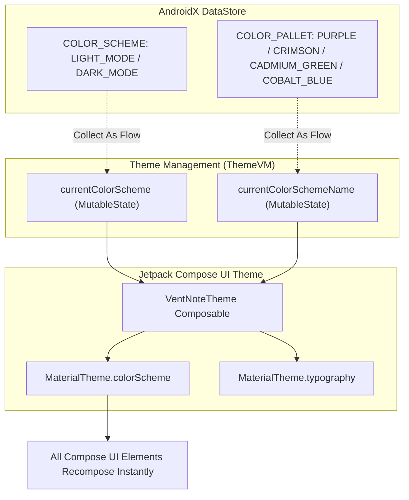
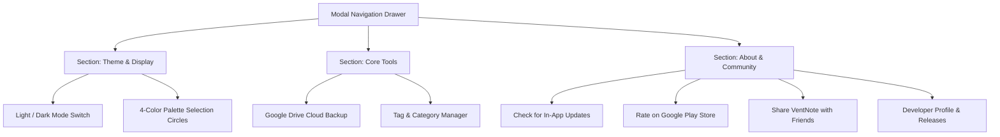

# Feature Specification: App Customization & Theming

VentNote incorporates a comprehensive Material 3 theming engine, providing deep visual personalization with curated color palettes, dark mode toggling, and an adaptive navigation drawer.

---

## 1. Theming Architecture



---

## 2. Curated Color Palettes

VentNote ships with 4 bespoke primary color schemes, each fully populated with high-contrast Material 3 tone variants (Primary, OnPrimary, PrimaryContainer, Surface, Background, etc.):

| Palette Name | Constant Key | Primary Tone | Description |
| :--- | :--- | :--- | :--- |
| **Purple** | `ColorPalletName.PURPLE` | `#6750A4` | Default balanced violet palette with royal accents |
| **Crimson** | `ColorPalletName.CRIMSON` | `#B3261E` | High-energy, warm ruby and crimson tones |
| **Cadmium Green** | `ColorPalletName.CADMIUM_GREEN` | `#2E7D32` | Calm, nature-inspired forest and sage hues |
| **Cobalt Blue** | `ColorPalletName.COBALT_BLUE` | `#1976D2` | Focused, professional sapphire and cobalt tones |

---

## 3. Dark Mode & Contrast Adaptation

* **Manual Override:** Users can toggle between Dark Mode and Light Mode from the Navigation Drawer.
* **OLED & Battery Optimization:** In Dark Mode, surface and background colors transition to deep gray/black tones (`#1C1B1F` / `#121212`), significantly reducing battery drain on OLED/AMOLED displays while keeping text high-contrast and legible.

---

## 4. Modal Navigation Drawer (`NavDrawer.kt`)

The navigation drawer acts as the central control panel for application-level settings and meta features:



### Adaptive Drawer Width:
To prevent awkward over-stretching on wide tablets, foldable unfolded screens, and Chromebooks, the drawer sheet enforces an adaptive responsive width:
```kotlin
val screenWidth = configuration.screenWidthDp.dp
val maxDrawerWidth = 320.dp

ModalDrawerSheet(
    modifier = Modifier
        .fillMaxHeight()
        .widthIn(max = maxDrawerWidth)
        .width(screenWidth * 0.8f)
)
```
On standard phones, it smoothly occupies 80% of the screen width, while on tablets, it cleanly clamps at 320.dp.
