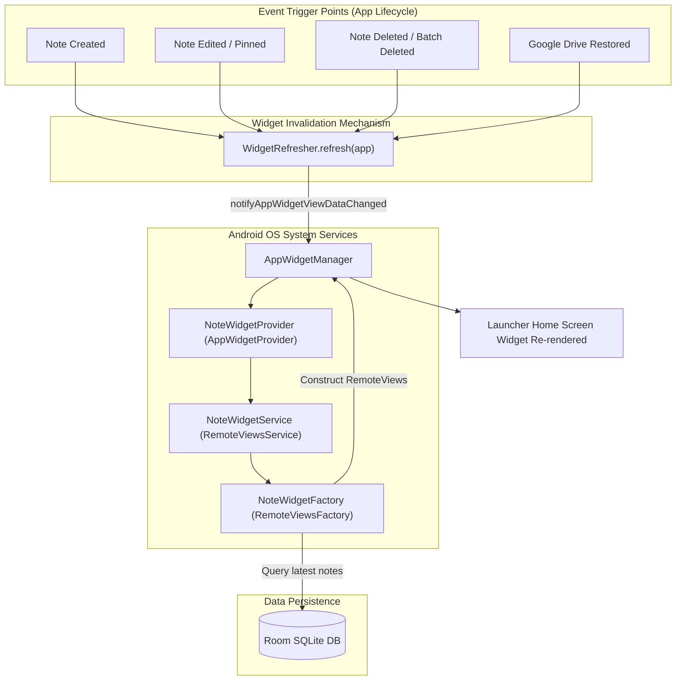

# Feature Specification: Launcher App Widget

VentNote provides an Android home screen widget allowing users to view recent notes at a glance and jump directly into note editing without launching the full application first.

---

## 1. Widget Architecture



---

## 2. Key Components

### 2.1 Provider (`NoteWidgetProvider.kt`)
Subclasses `AppWidgetProvider` and acts as the broadcast receiver handling `APPWIDGET_UPDATE` intents:
* Configures the widget layout (`layout/note_widget.xml`).
* Sets up a pending intent template for collection items, allowing tapping any individual note in the widget list to deep-link directly into `NoteDetailPage`.
* Configures the header button to launch `NoteCreationPage` for instantaneous note taking.

### 2.2 RemoteViews Service & Factory (`NoteWidgetService.kt` & `NoteWidgetFactory.kt`)
* **`NoteWidgetFactory`** implements `RemoteViewsService.RemoteViewsFactory`.
* In `onDataSetChanged()`, it queries the latest notes directly from Room SQLite using `databaseProxy.dao().getSyncNotes()`.
* Formats note titles, snippet text, and timestamps into `RemoteViews` item views.

### 2.3 Automatic Invalidation (`WidgetRefresher.kt`)
The widget must never display stale data. `WidgetRefresher.kt` provides an atomic helper function:

```kotlin
class WidgetRefresher @Inject constructor() {
    fun refresh(context: Context) {
        val appWidgetManager = AppWidgetManager.getInstance(context)
        val componentName = ComponentName(context, NoteWidgetProvider::class.java)
        val appWidgetIds = appWidgetManager.getAppWidgetIds(componentName)
        appWidgetManager.notifyAppWidgetViewDataChanged(appWidgetIds, R.id.note_list_view)
    }
}
```

Whenever notes are created, modified, deleted, or restored from Google Drive, `WidgetRefresher.refresh(app)` is immediately dispatched, ensuring the launcher widget stays in perfect lockstep with the app database.
