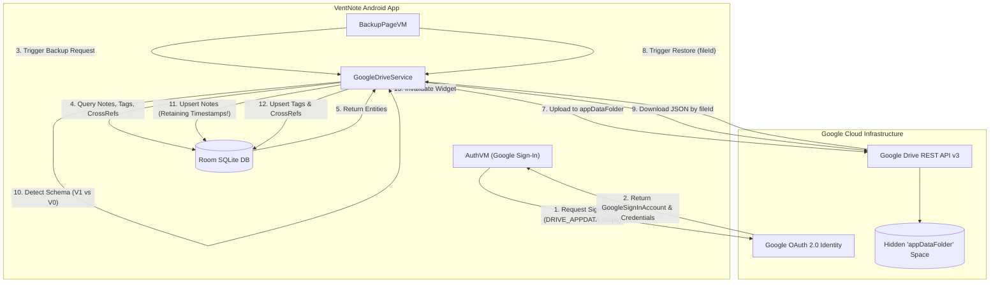

# Feature Specification: Google Drive Backup & Restore

The Google Drive Backup & Restore feature enables users to securely serialize, snapshot, and restore their entire VentNote workspace (notes, tags, and category associations) using their personal Google Drive cloud storage.

---

## 1. High-Level Sync Architecture



---

## 2. JSON Payload Schemas

### 2.1 Current Schema (Version 1: Full Workspace Payload)
The current format encapsulates notes, tags, and the relational cross-references inside a versioned envelope:

```json
{
  "version": 1,
  "notes": [
    {
      "id": 101,
      "title": "Grocery Shopping",
      "note": "Eggs, Milk, Sourdough Bread",
      "createdAt": 1782627000000,
      "updatedAt": 1782627500000,
      "isPinned": true
    },
    {
      "id": 102,
      "title": "",
      "note": "Quick meeting thought",
      "createdAt": 1782628000000,
      "updatedAt": 1782628200000,
      "isPinned": false
    }
  ],
  "tags": [
    {
      "id": 1,
      "name": "Shopping",
      "colorHex": "#FFF59D"
    },
    {
      "id": 2,
      "name": "Personal",
      "colorHex": "#EF9A9A"
    }
  ],
  "noteTags": [
    {
      "noteId": 101,
      "tagId": 1
    }
  ]
}
```

### 2.2 Legacy Schema (Version 0: Raw Notes Array)
Earlier versions of VentNote serialized backups as a plain JSON array of notes without any envelope or tag data:

```json
[
  {
    "id": 1,
    "title": "Legacy Note",
    "note": "Note written in VentNote 1.0",
    "createdAt": 1771742430000,
    "updatedAt": 1771742430000
  }
]
```

---

## 3. Dual-Format Backward-Compatible Restore Logic

When a user initiates a restore, the app downloads the JSON file from the hidden `appDataFolder`. The parsing engine inside [`GoogleDriveService.kt`](file:///Users/syubbanfakhriya/Desktop/Repository/side-project/VentNote/app/src/main/java/com/digiventure/ventnote/data/google_drive/service/GoogleDriveService.kt) is resilient and backward-compatible:

```mermaid
flowchart TD
    Start[Download JSON String from Google Drive] --> TryV1[Attempt parsing as BackupPayload class]
    TryV1 --> CheckV1{payload != null and payload.notes != null?}
    
    CheckV1 -- Yes (Version 1 Envelope) --> RestoreNotesV1[proxy.dao().upsertNotes(payload.notes)]
    RestoreNotesV1 --> RestoreTags[proxy.tagDao().insertTag for each tag in payload.tags]
    RestoreTags --> RestoreRefs[proxy.tagDao().insertNoteTagCrossRefs(payload.noteTags)]
    RestoreRefs --> WidgetSync[refresher.refresh(app)]
    
    CheckV1 -- No / JsonSyntaxException --> TryV0[Fallback: Parse as Array<NoteModel>]
    TryV0 --> RestoreNotesV0[proxy.dao().upsertNotes(legacyNotes)]
    RestoreNotesV0 --> EmptyTags[Tags remain empty / Notes are uncategorized]
    EmptyTags --> WidgetSync
    
    WidgetSync --> Success[Emit Result.success(Unit)]
```

---

## 4. Historical Timestamp Preservation Guarantee

> [!IMPORTANT]
> **Why Restored Notes Retain Their Original Timestamps**
> VentNote guarantees that restoring a backup **never** modifies the creation or modification dates of historical notes:
> 1. **No Timestamp Overwrite:** The restore engine calls `proxy.dao().upsertNotes(notes)`. Because this method uses Room's `@Insert(onConflict = OnConflictStrategy.REPLACE)` directly on the deserialized `NoteModel` objects, the exact `createdAt` and `updatedAt` values from the JSON file are written directly into SQLite.
> 2. **Timestamp Re-creation Avoided:** The app explicitly avoids calling `upsertNotesWithTimestamp(notes)`, which is only used when importing fresh data that needs current timestamp assignment.
> 3. **Result:** Notes display their exact historical creation and edit dates, preserving timeline fidelity across device migrations.

---

## 5. Security & Privacy Architecture

* **Hidden Storage (`appDataFolder`):** Backups are stored in Google Drive's isolated Application Data Folder (`DriveScopes.DRIVE_APPDATA`).
* **Inaccessible to Other Apps:** The backup JSON files cannot be seen, read, or modified by other apps or directly accessed by the user in Google Drive's root directory, preventing accidental deletion or tampering.
* **Old Backup Pruning:** To conserve the user's Drive quota, [`BackupPageVM.kt`](file:///Users/syubbanfakhriya/Desktop/Repository/side-project/VentNote/app/src/main/java/com/digiventure/ventnote/feature/backup/viewmodel/BackupPageVM.kt) cleans up older snapshots seamlessly after each successful backup.
