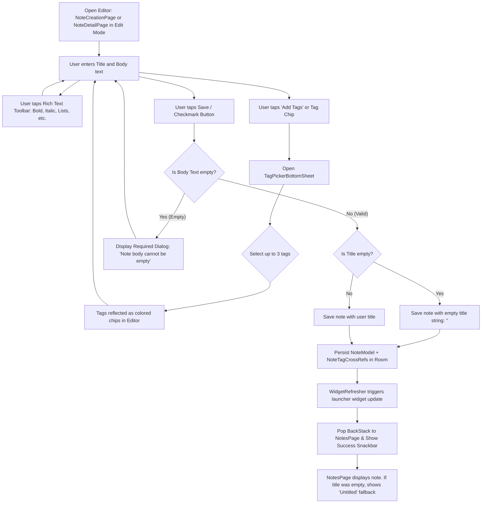
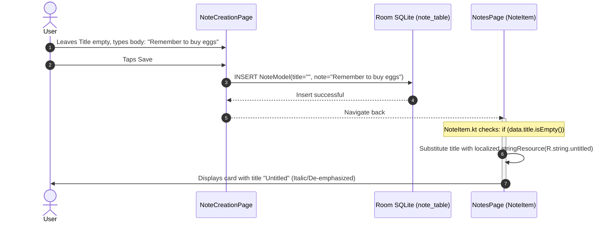

# Feature Specification: Note Editor & Rich Text Engine

The Note Editor encompasses note creation (`NoteCreationPage.kt`) and note viewing/editing (`NoteDetailPage.kt`). It features a rich text formatting engine, flexible title handling with automatic `"Untitled"` fallback, tag categorization, and edit-cancellation safeguards.

---

## 1. Note Creation & Editing Flowchart

---

## 2. Rich Text Formatting Engine

VentNote integrates a custom Markdown-based rich text editor:
* **State Management:** Uses `RichTextState` to handle span tracking, selection offsets, and styling.
* **Inline Toolbar:** A dedicated bar appears above the keyboard with one-tap formatting controls:
  * **Bold (`**text**`)**
  * **Italic (`*text*`)**
  * **Strikethrough (`~~text~~`)**
  * **Underline**
  * **Bulleted / Ordered Lists**
* **Dual Representation:** In memory, notes are held as formatted spanned text for fluid editing, and serialized as standard Markdown strings (`toMarkdown()`) when committed to Room SQLite.
* **Parser (`MarkdownParser.kt`):** When displaying note cards on the home screen or detail page, `MarkdownParser.parseToAnnotatedString()` parses the Markdown syntax into Jetpack Compose `AnnotatedString` with appropriate typography, colors, and line spacing.

---

## 3. Title Flexibility & `"Untitled"` Fallback

VentNote embraces a modern, frictionless note-taking experience where users do not need to invent titles for quick thoughts or reminders:

### Business Rules:
1. **Title is strictly optional:** Notes can be saved with an empty string (`""`) for `title`.
2. **Body is mandatory:** Attempting to save a note with empty body text (`bodyPlain.isEmpty()`) displays an informative error dialog preventing blank records.
3. **Display Fallback:** Note cards on `NotesPage` dynamically check `if (data.title.isEmpty())` and render the localized resource `R.string.untitled` (`"Untitled"`).

---

## 4. Tag Association in Editor

Notes can be tagged during creation or edited later in `NoteDetailPage`:
* **Entry Point:** A horizontal chip bar below the title field displays currently attached tags plus an **"Add Tags"** or **"Edit"** chip.
* **Tag Picker Modal:** Tapping the button launches `TagPickerBottomSheet`, listing all tags created in the app.
* **Enforced Ceiling (Max 3 Tags):** Notes can have at most **3 tags**. When 3 tags are selected, unselected tags become disabled and non-clickable (`canSelect = isSelected || selectedTagIds.size < 3`).
* **Direct Removal:** Users can tap the `"X"` on any tag chip in the editor to immediately detach it.

---

## 5. Discard & Cancellation Safeguards

If a user modifies an existing note in `NoteDetailPage` and decides to cancel:
1. Tapping the **Cancel** button opens a confirmation dialog: *"Are you sure you want to discard your changes?"*
2. Tapping **Confirm** resets the editor fields, reloads the original note and tag data from Room SQLite, and exits edit mode without modifying the database.
3. Tapping **Dismiss** keeps the editor open with user edits intact.
