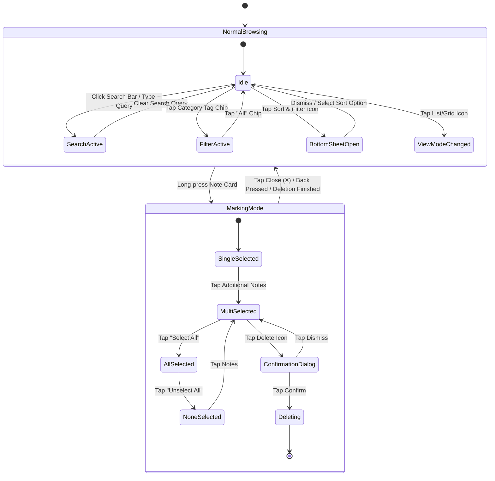
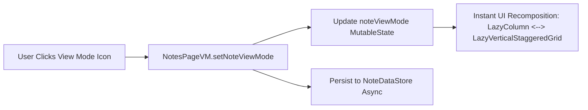
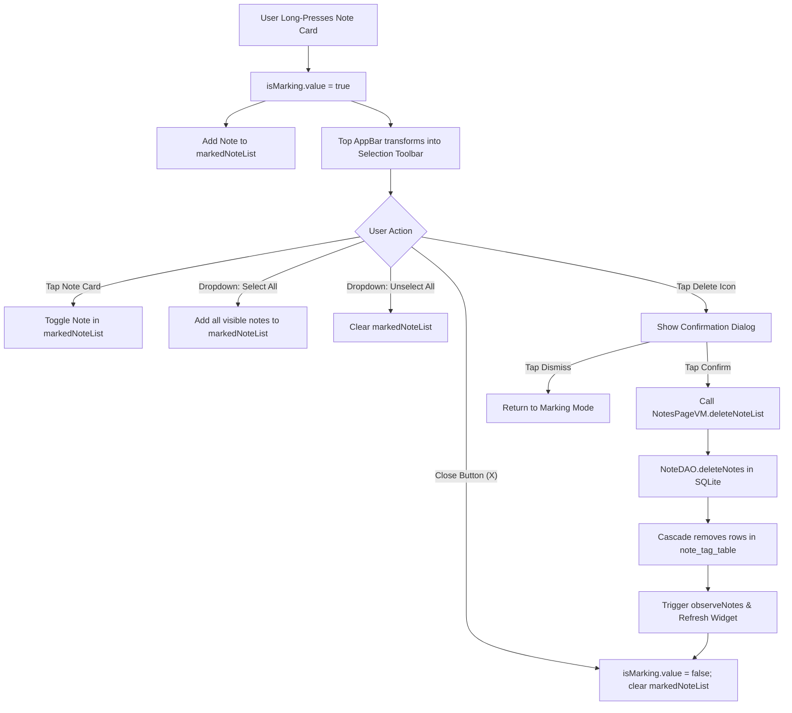

# Feature Specification: Note Management

The Note Management feature serves as the primary dashboard of VentNote (`NotesPage.kt`). It provides a fluid, responsive interface for viewing, organizing, searching, sorting, and batch-managing notes.

---

## 1. Feature Architecture & State Machine

---

## 2. Key Capabilities & Mechanics

### 2.1 Dual View Layout: List vs. Staggered Grid
Users can toggle between a traditional single-column Linear List and a dynamic multi-column Staggered Grid:
* **List View (`Constants.VIEW_MODE_LIST`):** Displays notes in a single vertical column (`LazyColumn`). Note preview text is capped at 4 lines.
* **Staggered Grid View (`Constants.VIEW_MODE_STAGGERED`):** Displays notes in an adaptive grid (`LazyVerticalStaggeredGrid` with `StaggeredGridCells.Adaptive(minSize = 160.dp)`). Note preview text expands up to 8 lines, accommodating variable note lengths organically.
* **Persistence:** The chosen view mode is saved instantly to AndroidX DataStore (`NOTE_VIEW_MODE`), surviving app restarts.

---

### 2.2 Live Search Filtering
The search bar resides in the collapsible top app bar:
* Typing into the search field updates `NotesPageVM.searchedTitleText`.
* The list filters instantaneously in-memory on both `title` and `note` (body text), performing case-insensitive matching.
* If a category tag chip is simultaneously active, the search scope is strictly constrained to the notes inside that tag.

---

### 2.3 Sort & Filter System
A dedicated bottom sheet allows users to sort notes across three dimensions in either ascending or descending direction:

| Sort Attribute | Ascending (`ASC`) | Descending (`DESC`) |
| :--- | :--- | :--- |
| **Updated Date** (`updated_at`) | Oldest modified first | **Most recently modified first (Default)** |
| **Created Date** (`created_at`) | Oldest created first | Newest created first |
| **Title** (`title`) | Alphabetical (A → Z) | Reverse Alphabetical (Z → A) |

> [!NOTE]
> Pinned notes are always displayed at the very top of the list, regardless of which sort criteria or ordering direction is active (see [Note Pinning](note_pinning.md)).

---

### 2.4 Multi-Selection & Batch Deletion (Marking Mode)

Marking mode allows power users to manage multiple notes in a single transaction:

#### Detailed Marking Mode Features:
1. **Visual Feedback:** Selected cards display a highlighted checkmark icon in their header.
2. **Dynamic Counter:** The top app bar updates live with `"N selected"` as items are toggled.
3. **Dropdown Menu Actions:**
   * **Select All:** Adds all visible notes to the selection set.
   * **Unselect All:** Empties the selection set without exiting marking mode.
4. **Safety Confirmation:** Deleting selected notes triggers a modal confirmation dialog to prevent accidental data loss.
5. **Dismissal & Back Handler:** Pressing the device hardware back button or tapping the `"X"` icon cleanly exits marking mode and clears selections.
