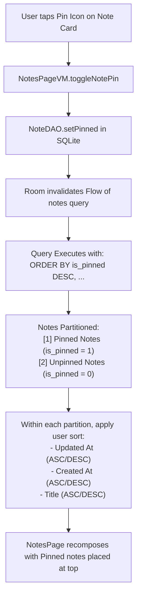
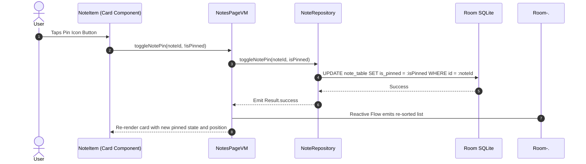

# Feature Specification: Note Pinning

The Note Pinning feature allows users to keep critical notes permanently affixed to the top of their dashboard, regardless of active sort settings, date modifications, or alphabetical ordering.

---

## 1. Pinning Mechanics & Prioritization Engine



---

## 2. Relational & Database Architecture

* **Database Column:** `is_pinned: Boolean` on `note_table` (default = `false`).
* **Database Index:** An explicit index on `is_pinned` ensures queries do not incur full table scans when partitioning notes.
* **SQL Ordering Clause:** In [`NoteDAO.kt`](file:///Users/syubbanfakhriya/Desktop/Repository/side-project/VentNote/app/src/main/java/com/digiventure/ventnote/data/persistence/dao/NoteDAO.kt), all select queries place `is_pinned DESC` first:

```sql
SELECT * FROM note_table ORDER BY 
    is_pinned DESC,
    CASE WHEN :sortBy = 'updated_at' AND :orderBy = 'DESC' THEN updated_at END DESC,
    ...
```

---

## 3. UI Implementation & Micro-Interactions

### 3.1 Card-Level Quick Pin Button
* **Placement:** Located directly in the top-right corner of each note card (`NoteItem.kt`).
* **Visual States:**
  * **Pinned:** Pin icon filled with the primary theme color (`MaterialTheme.colorScheme.primary`).
  * **Unpinned:** Pin outline tinted with subtle on-surface opacity (`MaterialTheme.colorScheme.onSurface.copy(alpha = 0.4f)`).
* **Test Tag:** Formatted as `${TestTags.PIN_ICON_BUTTON}_${note.id}` for reliable automated testing.
* **Spring Animation:** The pin icon features a bouncy spring micro-animation (`dampingRatio = Spring.DampingRatioMediumBouncy`) to provide delightful tactile feedback upon toggling.



---

## 4. Interaction with Other Features

| Feature | Interaction Behavior |
| :--- | :--- |
| **Sort & Order** | Pinning always takes precedence. Changing the sort to "Title A-Z" sorts pinned notes alphabetically amongst themselves at the top, followed by unpinned notes sorted alphabetically below them. |
| **Tag Filtering** | When filtering by a category tag (e.g., `"Work"`), pinned notes associated with `"Work"` appear at the top of that specific category view. Notes not containing the tag are filtered out regardless of pin status. |
| **Search Query** | When the user searches, matching notes are shown. If both pinned and unpinned notes match the query, the pinned matching notes appear first. |
| **Batch Deletion** | Pinned notes can be selected and deleted in Marking Mode just like standard notes, preceded by the safety confirmation dialog. |
| **Google Drive Sync** | The `is_pinned` boolean is fully serialized inside `BackupPayload` JSON and restored faithfully. |
