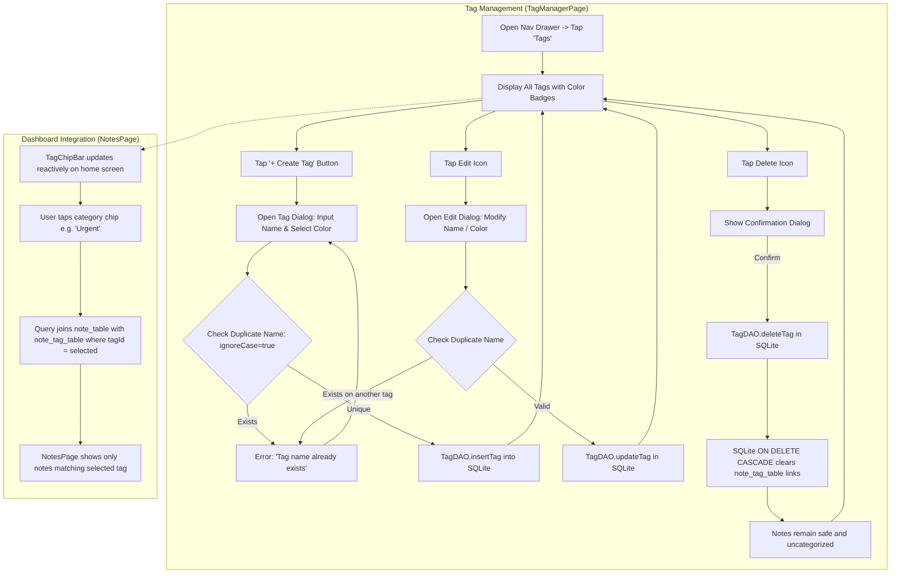
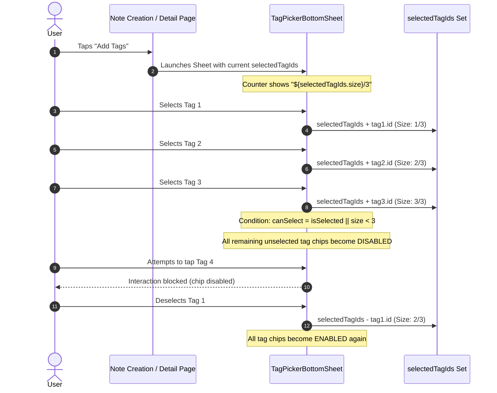

# Feature Specification: Tag & Category System

The Tag and Category System provides flexible Many-to-Many ($M:N$) categorization for notes, featuring a dedicated Tag Manager, a curated color palette, case-insensitive duplicate prevention, horizontal filter chips on the dashboard, and a strict constraint of maximum 3 tags per note.

---

## 1. System Lifecycle & Workflow



---

## 2. Key Capabilities & Business Rules

### 2.1 Curated 12-Color Palette
Tags can be assigned one of 12 vibrant, high-contrast pastel colors designed to look elegant in both Light and Dark themes:
* Red (`#EF9A9A`), Pink (`#F48FB1`), Purple (`#CE93D8`), Deep Purple (`#B39DDB`)
* Indigo (`#9FA8DA`), Blue (`#90CAF9`), Cyan (`#80DEEA`), Teal (`#80CBC4`)
* Green (`#A5D6A7`), Amber (`#FFE082`), Orange (`#FFCC80`), Deep Orange (`#FFAB91`)

### 2.2 Case-Insensitive Duplicate Name Validation
To prevent confusing duplicates (e.g., `"Work"` vs. `"work"`), [`TagManagerVM.kt`](file:///Users/syubbanfakhriya/Desktop/Repository/side-project/VentNote/app/src/main/java/com/digiventure/ventnote/feature/tag_manager/viewmodel/TagManagerVM.kt) enforces strict validation before inserting or updating:

```kotlin
val nameExists = existingTags.any { 
    it.name.equals(tag.name.trim(), ignoreCase = true) && it.id != tag.id 
}
if (nameExists) {
    return@withContext Result.failure(Exception("Tag name already exists"))
}
```

### 2.3 Cascading Deletion & Note Safety Guarantee
Deleting a tag removes it permanently from `tag_table`. Thanks to Room's foreign key constraint (`onDelete = ForeignKey.CASCADE` on `NoteTagCrossRef`), SQLite automatically cleans up all associated junction rows in `note_tag_table`.
* **Zero Note Loss:** The notes themselves are **never deleted**. They simply lose their association with that specific tag and remain in the database as uncategorized (or tagged with their remaining tags).

---

## 3. Strict 3-Tag Limit per Note

To maintain visual harmony, clean note cards, and focused organization, notes have a hard cap of **3 tags maximum**:



### Direct Card Rendering (No `+N` Badge):
Because notes can have at most 3 tags, the note card (`NoteItem.kt`) renders each tag chip directly using a horizontal `LazyRow`. The redundant `+N` overflow badge has been completely eliminated for cleaner UI minimalism.

---

## 4. Dashboard Folder Chip Bar (`TagChipBar.kt`)

The home screen features a horizontal scrolling chip bar immediately beneath the top app bar:
1. **"All Notes" Chip:** The first chip represents all notes (`selectedTagId = null`). Tapping it clears any category filter.
2. **Category Chips:** Every custom tag appears with its colored circle dot and name.
3. **Quick Tag Management:** An "Add / Manage Tags" button at the end of the chip bar allows direct navigation to `TagManagerPage`.
4. **Active State:** The selected chip is highlighted with the primary container color and bold typography.
